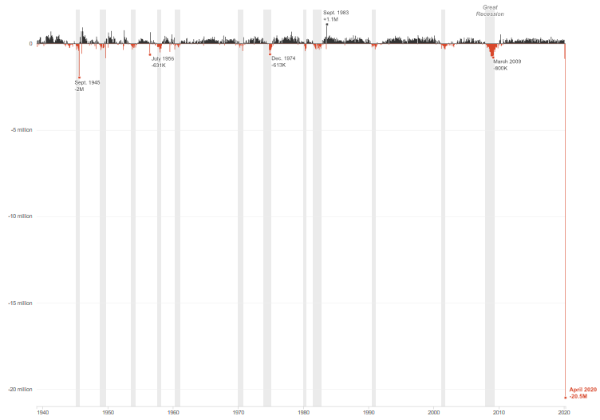
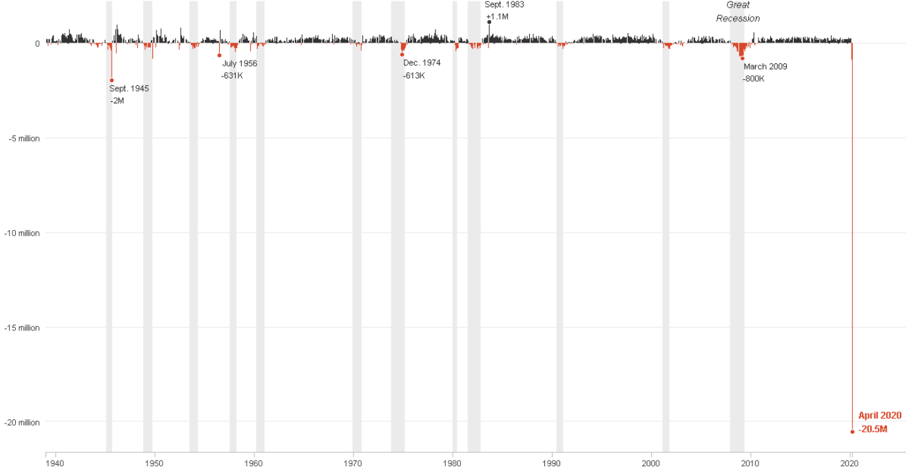

Earlier this month, I came across a striking chart from NPR that showed the historic in employment in April 2020 due to COVID-19: 


<i>Source: [NPR](https://www.npr.org/sections/coronavirus-live-updates/2020/05/08/852430930/one-for-the-history-books-14-7-unemployment-20-5-million-jobs-wiped-away)</i>

The chart does an excellent job of relaying how historic the drop in payroll was by highlighting the periods of economic recession and adding text labels so that the reader can easily put the drop into historical perspective.

## Idea for Blog Series

The chart from NPR inspired me to start a blog series where I try to re-create data visualizations I come across on the internet and share my process with others.

This is part one in the series with more to come later.

## Acquiring the Data

The Total Nonfarm Payroll data is available from the Federal Reserve Bank of St. Louis through it's Federal Reserve Economic Data (FRED) database.

Loading the data in R is easy thanks to the `fredr` package which allows you to fetch data from the FRED API.

```{r warning=FALSE, message=FALSE}
library(fredr)
```

In order to connect to the FRED API, you need to first obtain a [FRED API key](https://research.stlouisfed.org/docs/api/api_key.html). Once you have a key, replace the "FRED_API_KEY" below with your key number and you will be granted access to the FRED database.

```{r eval=FALSE}
fredr_set_key(FRED_API_KEY)
```

The Total Nonfarm Payroll series we want to load is called [PAYEMS](https://fred.stlouisfed.org/series/PAYEMS). 

In the code below, we just need to specify the series name and include `units = "chg"` in order to get the month-to-month change:

```{r warning=FALSE, message=FALSE}
fredr(series_id = "PAYEMS", units = "chg")
```

The first observation in dataset above, January 1939, contains a missing value since we pulled the month-to-month change and this was the first month in the series.

In the code below, we can replace the NA with 0 by using `replace(is.na(.), 0)` and create a new column called `color_assign` that assigns the color black to values with a positive change and red to values with a negative change in order to match the colors used within the NPR chart.

```{r warning=FALSE, message=FALSE, code_folding=TRUE}
library(tidyverse)

dataset <- fredr(series_id = "PAYEMS", units = "chg") %>% 
           filter(date <= "2020-04-01") %>% 
           replace(is.na(.), 0) %>% 
           mutate(value = value/1000,
                  color_assign = ifelse(value > 0, "black", 
                                 ifelse(value == 0, "grey", "red")))
```

<br>

## Creating the Chart

The package we will use to create the chart is the `ggplot2` package.

Let's start by making a basic plot of the dataset:

```{r warning=FALSE, message=FALSE, code_folding=TRUE}
ggplot(data = dataset, 
       aes(x = date, y = value, colour = color_assign, fill = color_assign)) +
  # Add columns to plot
  geom_col(width = 1) +
  theme_minimal()
```

As you can see, the `color_assign` column we created earlier matched the names of the colors to the values correctly, but did not match the colors themselves correctly. This is because the `ggplot2` package assigns the colors to categories by default, but no worries, as we can change this by manually assigning the colors as shown below:

```{r warning=FALSE, message=FALSE, code_folding=TRUE}
ggplot(data = dataset, 
       aes(x = date, y = value, colour = color_assign, fill = color_assign)) +
  geom_col(width = 1) +
  # Assign black, grey, and red colors
  scale_colour_manual(values = c("#333333","#EBEBEB","#D8472B")) +
  scale_fill_manual(values = c("#333333","#EBEBEB","#D8472B")) +
  theme_minimal()
```

### Adding Recession Periods

In order to add the grey U.S. recession periods in the NPR chart, we first need to define the start and end dates of each recession.

The recession dates are available from FRED [here](https://fredhelp.stlouisfed.org/fred/data/understanding-the-data/recession-bars/) dating back to the first recorded U.S. recession in 1857. Since our dataset starts in 1939, we just need the recession periods from everything past that date and we can put them into a table like so below:

```{r warning=FALSE, message=FALSE, code_folding=TRUE}
recession_periods = read.table(textConnection(
  "Start, End
  1945-02-01, 1945-10-01
  1948-11-01, 1949-10-01
  1953-07-01, 1954-05-01
  1957-08-01, 1958-04-01
  1960-04-01, 1961-02-01
  1969-12-01, 1970-11-01
  1973-11-01, 1975-03-01
  1980-01-01, 1980-07-01
  1981-07-01, 1982-11-01
  1990-07-01, 1991-03-01
  2001-03-01, 2001-11-01
  2007-12-01, 2009-06-01"), sep=',',
  colClasses=c('Date','Date'), header=TRUE)

recession_periods
```

Now, we can add the recession periods to our plot using the `geom_rect` function and assigning a grey color code to it. Please note that the order of the below code matters. Since we want the recession periods to be displayed <i>behind</i> our data values, it needs to come before we call `geom_col` or else it will be blocking the month-to-month change columns.

```{r warning=FALSE, message=FALSE, code_folding=TRUE}
ggplot(data = dataset, 
       aes(x = date, y = value, colour = color_assign, fill = color_assign)) +
  # Add grey bars for recession periods 
  geom_rect(data = recession_periods, inherit.aes = FALSE, aes(xmin = Start, xmax = End, ymin = -Inf, ymax = +Inf), fill = '#EBEBEB') +
  geom_col(width = 1) +
  scale_colour_manual(values = c("#333333","#EBEBEB","#D8472B")) +
  scale_fill_manual(values = c("#333333","#EBEBEB","#D8472B")) +
  theme_minimal()
```

### Cleaning up the Axes and Theme

Now that we have the data plotted, we need to match the aesthetics of the NPR chart. This includes adjusting the axes and removing the vertical lines and legend in our current plot. 

In order to adjust the axes, we need to first assign the limits for both below:

```{r warning=FALSE, message=FALSE, code_folding=TRUE}
# Assign limits for the y axis (in millions)
ylab <- c(-20,-15,-10,-5,0)

# Change the x axis date range to display every 10 years
custom_breaks <- c(min(dataset$date),
                   seq(from = as.Date("1940-01-01"), 
                       to = as.Date("2020-01-01"),
                       by = "10 years"),
                   max(dataset$date))
```

In the code below, we're able to add the word "million" to the y axis label within `scale_y_continuous` and use `scale_x_date` to display the `custom_breaks` correctly on the x axis. 

We also call a number of arguments within `theme`, such as `panel.grid.major.x = element_blank()`, which removes the vertical lines seen on the plot above.

```{r warning=FALSE, message=FALSE, code_folding=TRUE}
ggplot(data = dataset, 
       aes(x = date, y = value, colour = color_assign, fill = color_assign)) +
  geom_rect(data = recession_periods, inherit.aes = FALSE, aes(xmin = Start, xmax = End, ymin = -Inf, ymax = +Inf), fill = '#EBEBEB') +
  geom_col(width = 1) +
  scale_colour_manual(values = c("#333333","#EBEBEB","#D8472B")) +
  scale_fill_manual(values = c("#333333","#EBEBEB","#D8472B")) +
  # Add the word 'million' to the y axis labels
  scale_y_continuous(labels = ifelse(ylab == 0, ylab, paste0(ylab, ' million'))) +
  # Display dates on x axis by every 10 years
  scale_x_date(breaks = custom_breaks, labels = c("", seq("1940","2020", by=10), ""), expand = c(0,0,0.08,0)) +
  theme_minimal() +
  # Clean up aesthetics of chart
  theme(legend.position = "none",
        axis.line.x = element_line(size = 0.5, colour = "grey"),
        axis.ticks.x = element_line(colour = "grey"),
        axis.ticks.length.x = unit(0.15, "cm"),
        axis.text.x = element_text(size = 8),
        axis.text.y = element_text(size = 8),
        panel.grid.minor = element_blank(),
        panel.grid.major.x = element_blank()) +
  # Remove 'date' and 'value' axis labels
  labs(x = "", y = "")
```

### Adding Text Labels

The only thing left to do is add the text labels to the plot.

Each label on the NPR chart has a small dot to show exactly where the text label is pointing out. We can add these dots by using `geom_point` and then add the text to each dot using `geom_point` and filtering for each date NPR called out.

```{r eval=FALSE, warning=FALSE, message=FALSE, code_folding=TRUE}
ggplot(data = dataset, 
       aes(x = date, y = value, colour = color_assign, fill = color_assign)) +
  geom_rect(data = recession_periods, inherit.aes = FALSE, aes(xmin = Start, xmax = End, ymin = -Inf, ymax = +Inf), fill = '#EBEBEB') +
  geom_col(width = 1) +
  # Add red dots to large negative values
  geom_point(data = .%>% filter(date %in% as.Date(c("1945-09-01","1956-07-01","1974-12-01","2009-03-01","2020-04-01"))), shape = 21, colour = "white", fill = "#D8472B", size = 2) +
  # Add black dot to large poisitive values
  geom_point(data = .%>% filter(date %in% as.Date("1983-09-01")), shape = 21, colour = "white", fill = "#333333", size = 2) +
  # Add text lable for April 2020
  geom_text(data = .%>% filter(date == max(date)), aes(label = paste0("April 2020\n ", round(value,1),"M"), fontface = 2), vjust = -0.01, hjust = -0.15,  size = 3.2, color = "#D8472B", family = "Arial") +
  # Add text lable for September 1945
  geom_text(data = .%>% filter(date == "1945-09-01"), aes(label = paste0("Sept. 1945\n", round(value,1),"M")), vjust = 1.2, hjust = 0.05, size = 3, color = "#363636", family = "Arial") +
  # Add text lable for July 1956
  geom_text(data = .%>% filter(date == "1956-07-01"), aes(label = paste0("July 1956\n", round(value*1000,1),"K")), vjust = 1.2, hjust = -0.1, size = 3, color = "#363636", family = "Arial") +
  # Add text lable for December 1974
  geom_text(data = .%>% filter(date == "1974-12-01"), aes(label = paste0("Dec. 1974\n", round(value*1000,1),"K")), vjust = 1.2, hjust = -0.05, size = 3, color = "#363636", family = "Arial") +
  # Add text lable for September 1983
  geom_text(data = .%>% filter(date == "1983-09-01"), aes(label = paste0("Sept. 1983\n+", round(value,1),"M")), vjust = -0.15, hjust = 0.1, size = 3, color = "#363636", family = "Arial") +
  # Add text lable for March 2009
  geom_text(data = .%>% filter(date == "2009-03-01"), aes(label = paste0("March 2009\n", round(value*1000,1),"K")), vjust = 1.2, hjust = -0.05, size = 3, color = "#363636", family = "Arial") +
  # Add text lable for Great Recession
  geom_text(data = .%>% filter(date == "2008-10-01"), aes(label = "Great\nRecession", fontface = 3), vjust = -1.5, size = 3.2, color = "#363636", family = "Arial") +
  scale_colour_manual(values = c("#333333","#EBEBEB","#D8472B")) +
  scale_fill_manual(values = c("#333333","#EBEBEB","#D8472B")) +
  scale_y_continuous(labels = ifelse(ylab == 0, ylab, paste0(ylab, ' million'))) +
  scale_x_date(breaks = custom_breaks, labels = c("", seq("1940","2020", by=10), ""), expand = c(0,0,0.08,0)) +
  theme_minimal() +
  theme(legend.position = "none",
        axis.line.x = element_line(size = 0.5, colour = "grey"),
        axis.ticks.x = element_line(colour = "grey"),
        axis.ticks.length.x = unit(0.15, "cm"),
        axis.text.x = element_text(size = 8),
        axis.text.y = element_text(size = 8),
        panel.grid.minor = element_blank(),
        panel.grid.major.x = element_blank()) +
  labs(x = "", y = "")
```

### Final Result



And there's our final result. Here's the plot from NPR again for reference. May not be an exact match but it's pretty close!


Thank you for following along and stay tuned for more attempts to re-create data visualizations seen on the internet!
