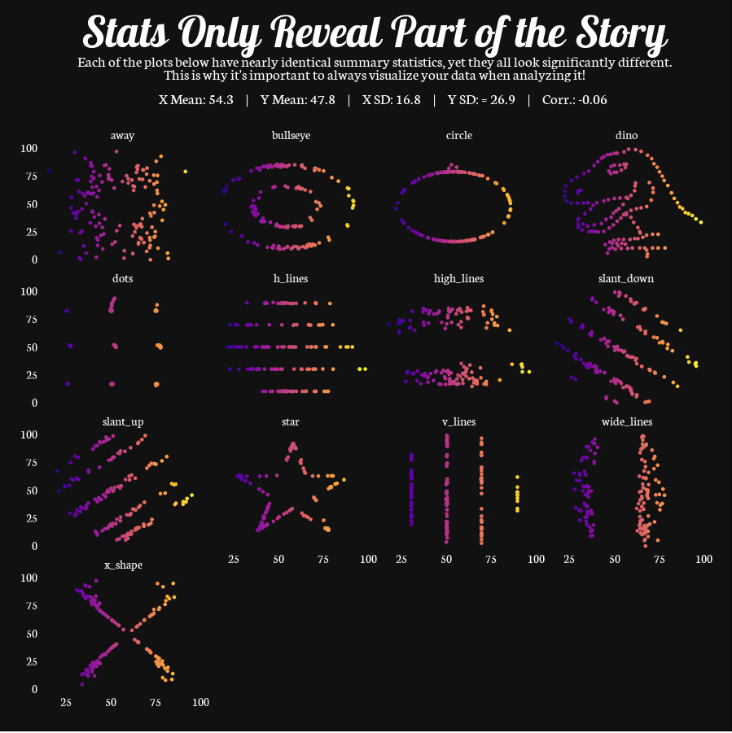
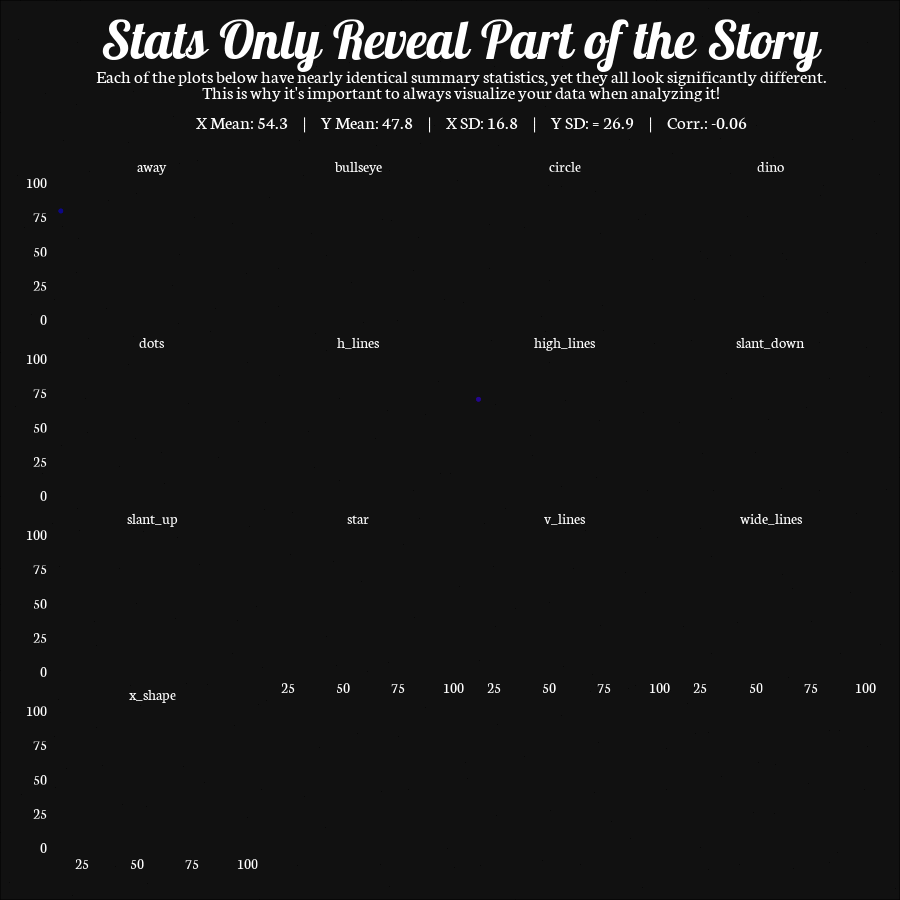

# Static Chart

Below is a chart I made for [#TidyTuesday](https://github.com/rfordatascience/tidytuesday), a weekly social data project in R.

The aim for this project was to display the "Datasaurus Dozen", which is a dataset that contains 13 sets of data that have nearly identical summary statistics (mean of x, mean of y, standard deviation of x, standard deviation of y, and Pearson correlation between x and y), yet appear to be completely different when shown on a scatter plot.

The great thing about using the [{gganimate}](https://gganimate.com/index.html) package is that you can add it to an existing {ggplot2} chart. So, the first thing I did was create a normal, static chart below:

```{r, eval=FALSE}
library(tidyverse)
library(gganimate)
library(showtext)

### add google fonts for ggplot
font_add_google(name = "Neuton",
                family = "Neuton")
font_add_google(name = "Lobster",
                family = "Lobster")
showtext_auto()

### read in data from tidytuesday repo
datasaurus <-
  readr::read_csv(
    'https://raw.githubusercontent.com/rfordatascience/tidytuesday/master/data/2020/2020-10-13/datasaurus.csv'
  )

### summarize dataset
datasaurus_summary <- datasaurus %>%
  group_by(dataset) %>%
  summarize(
    mean_x = mean(x),
    mean_y = mean(y),
    sd_x = sd(x),
    sd_y = sd(y),
    cor = cor(x, y, method = "pearson")
  )

datasaurus2 <- datasaurus %>%
  inner_join(datasaurus_summary, by = c("dataset" = "dataset"))

### build plot
p <- ggplot(datasaurus2, aes(x = x, y = y, color = x)) +
  geom_point(size = 1.5, alpha = 0.8) +
  facet_wrap( ~ dataset, strip.position = "top") +
  scale_colour_viridis_c(option = "plasma") +
  theme_minimal() +
  theme(
    legend.position = 'none',
    axis.text = element_text(
      color = "white",
      family = "Neuton",
      size = 11
    ),
    axis.title = element_blank(),
    plot.title = element_text(
      color = "white",
      family = "Lobster",
      size = 40,
      hjust = 0.5,
      margin = margin(10, 0, 0, 0)
    ),
    plot.subtitle = element_text(
      color = "white",
      family = "Neuton",
      size = 14,
      hjust = 0.5,
      margin = margin(10, 5, 25, 5)
    ),
    panel.grid.major = element_blank(),
    panel.grid.minor = element_blank(),
    strip.background = element_blank(),
    strip.placement = "outside",
    strip.text = element_text(
      color = "white",
      family = "Neuton",
      size = 12
    ),
    plot.background = element_rect(fill = "#111111"),
    plot.margin = unit(c(1, 2, 2, 2), "lines")
  ) +
  labs(
    title = "Stats Only Reveal Part of the Story",
    subtitle = "Each of the plots below have nearly identical summary statistics, yet they all look significantly different.\nThis is why it's important to always visualize your data when analyzing it!\n
       X Mean: 54.3     |     Y Mean: 47.8     |     X SD: 16.8     |     Y SD: = 26.9     |     Corr.: -0.06"
  )
```



# Animated Chart

There are different ways that you can animate a chart with `{gganimate}`. The animation I decided to add was to "reveal" the data points and then make them disappear. To do this, all I needed to do was add `transition_reveal()` to the end of the static chart made above, along with `ease_aes()` which controls the progression of the animation.

I decided to "reveal" the data points along the x-axis so that they would appear from left-to-right with `transition_reveal(x)`, but this could be changed to the y-axis to reveal from bottom-to-top, if desired.

<i>Note: the code that begins with `animate()` is not required to animate the chart. I just used it to save it as a gif for better portability.</i>

```{r, eval=FALSE}
### add animation with gganimate
p2 <- p + geom_point(aes(group = seq_along(x))) +
  transition_reveal(x) +
  ease_aes('linear')

### animate to gif
animate(
  p2,
  nframes = 40,
  fps = 5,
  end_pause = 5,
  rewind = TRUE,
  width = 900,
  height = 900,
  type = "cairo"
)
```


